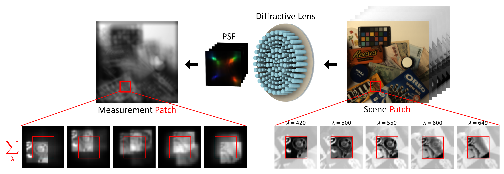
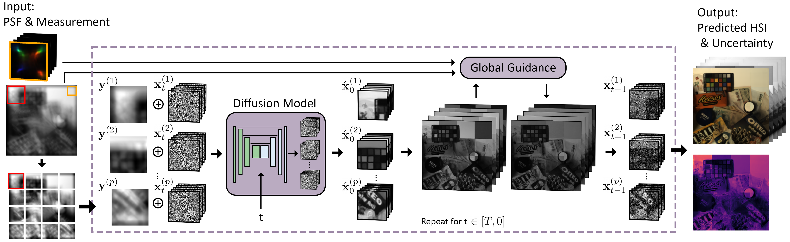

<h1 align="center"> Grayscale to Hyperspectral at Any Resolution Using A Phase-Only Lens</h1>

<h2> This page is in development. Files will be added and modified. This is an early access. </h2>
<p align="center">
  <a href="https://deanhazineh.github.io/publications/DiffVis/diffvis_home.html">
    
  </a>
  <a href="https://arxiv.org/abs/2412.02798">
    
  </a>
</p>

<h2> Overview </h2>
This work explores the inverse problem of reconstructing a hyperspectral image from a single, blurry grayscale measurement captured on a filterless photosensor. Although challenging and previously unsolved, this task is possible because a diffractive lens can encode the hyperspectral information via chromatic abberration. In our work, we introduce the first model to date that is capable of producing high-quality reconstructions and reverses the forward measurement shown below.
<p align="center">
  <strong style="font-size:20px;">The Forward Measurement Model</strong>
</p>
<p align="center">
  
</p>

Our solution is based on a novel "divide-and-conquer" approach to restoration. We train a generative hyperspectral diffusion model that processes small 64x64 patches in the measurement and produces a hyperspectral patch estimate. We denoise many patches together in parallel and synchronize their estimates using guidance as the denoising process unfolds to obtain the full-size reconstruction. This strategy allows us to train our diffusion model on patches from limited real-world datasets and then deploy our model to reconstruct measurements that are captured at any resolution. A depiction of our algorithm is shown below.  

<p align="center">
  <strong style="font-size:20px;">Solving the Inverse Problem with guided, patch diffusion</strong>
</p>
<p align="center">
  
</p>
<p align="center">
  
</p>

<h2> Code Installation </h2>
Use this code by cloning the repository and installing it locally via:

```
git clone https://github.com/DeanHazineh/DiffVis.git
pip install -e .
```

This will automatically install all dependencies. You will need to install torch manually if you have not and configure it appropriately to use your GPU. Note that xformers is a requirement when loading this projects pre-trained model checkpoints. If xformers is not installed, it will silently fail by defaulting to uninitialzed attention layers!
