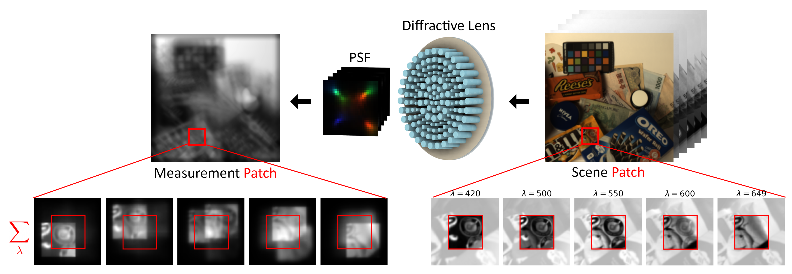
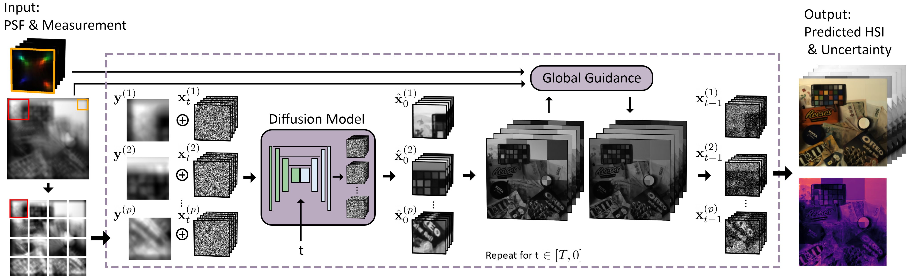

<h1 align="center">Grayscale to Hyperspectral at Any Resolution Using A Phase-Only Lens (page in development 12/24)</h1>

  
  

  <strong style="font-size:20px;">The Forward Measurement Model</strong>

  

  <strong style="font-size:20px;">Solving the Inverse Problem with guided, patch diffusion</strong>

  

  

